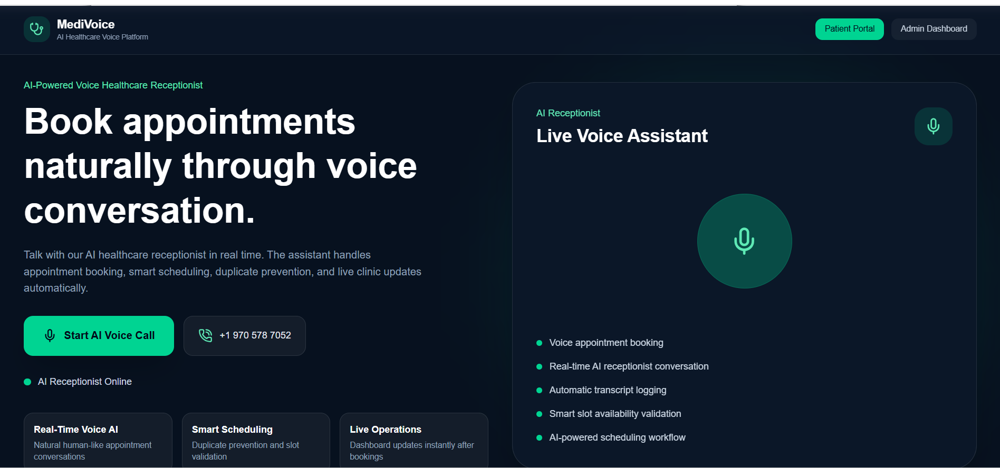
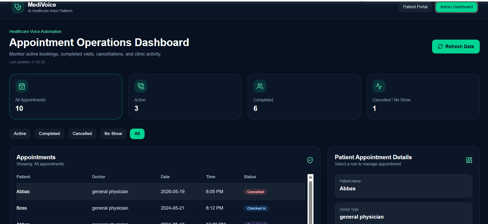
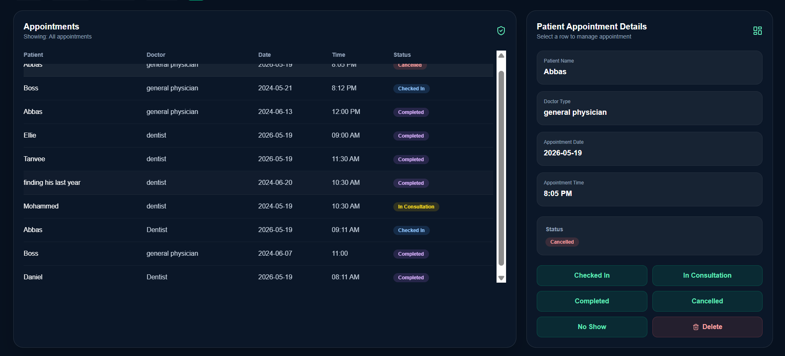

# 🏥 MediVoice AI Healthcare Receptionist

An AI-powered healthcare voice receptionist system that allows patients to book appointments naturally through real-time voice conversations.

Built using:

- React + Vite
- FastAPI
- SQLite
- Vapi AI Voice Assistant
- Tailwind-style modern UI
- Real-time appointment dashboard

---

# ✨ Features

## 🎤 AI Voice Appointment Booking
Patients can speak naturally with the AI receptionist to:

- Book appointments
- Select doctor types
- Choose appointment dates/times
- Confirm bookings

---

## 📊 Admin Dashboard

Real-time dashboard for monitoring:

- Active appointments
- Patient records
- Appointment statuses
- Booking updates

---

## 🔄 Appointment Status Management

Admin can update:

- Checked In
- Completed
- Cancelled
- No Show

---

## 🧠 AI Receptionist

Powered by:

- Vapi AI Voice Assistant
- Real-time voice conversation
- Natural language interactions

---

# 🏗️ System Architecture

Frontend:
- React
- Vite
- Axios
- Lucide Icons

Backend:
- FastAPI
- SQLAlchemy
- SQLite

AI Voice:
- Vapi AI SDK

---

# 📸 Screenshots

## Patient Portal



## Admin Dashboard


---

# ⚙️ Installation

# 1️⃣ Clone Repository

```bash
git clone https://github.com/YOUR_USERNAME/MediVoice-Agent.git